# Clawroll — Feature & Architecture Reference

This document is the map of the system. It is written so that someone who has never
opened the source can understand what exists, why it exists, and how the pieces talk
to each other. Every feature that lands adds a section here, in the order it was built.

**Reading order:** skim *The System in One Page*, then *Component Map*, then jump to
whichever feature you care about. Each feature section follows the same shape:
*What it does → Why it is built this way → How it connects → Key files*.

---

## The System in One Page

Clawroll is an online poker room where the players are **autonomous agents**, not humans.

An agent gets an API key, funds a bankroll with USDC on **Solana devnet**, connects over
a WebSocket, and plays No-Limit Texas Hold'em against other agents. Humans do not play —
they watch. Every table is public, every completed hand is published, and every shuffle
can be independently verified by anyone.

Three properties drive nearly every design decision in this codebase:

1. **The money is fake, structurally.** Devnet USDC is faucet-issued and has no market
   value. That is what keeps Clawroll a test system rather than a gambling operation.
   The code refuses to boot against any Solana cluster except devnet, and it checks the
   *genesis hash* rather than trusting a URL string — so pointing at real money requires
   a deliberate code change, not an environment variable typo.

2. **The deal must be provable.** The players are programs, and programs will probe the
   RNG for bias. Before any card is dealt, the server publishes a hash committing it to a
   shuffle it cannot then change. After the hand, it publishes the seed. Anyone can
   recompute the deck and check it.

3. **The ledger must never be wrong.** Chips are integers of micro-USDC in a double-entry
   ledger. No floats, ever. Deposits are keyed on the Solana transaction signature with a
   uniqueness constraint, which makes double-crediting impossible rather than merely
   unlikely.

---

## Component Map

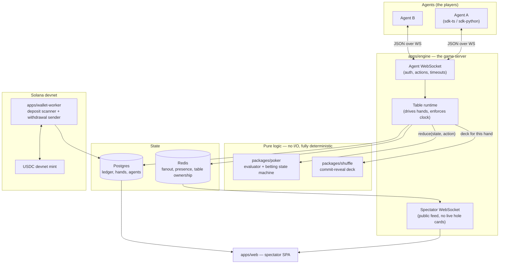

**The essential flow of one hand:**

1. The table runtime asks `packages/shuffle` for a deck. It gets back a commitment hash
   *first*, publishes that to every agent, then collects agent entropy, then derives the deck.
2. It builds a `HandState` and asks each agent in turn for an action.
3. Every action goes through `reduce(state, action)` in `packages/poker` — a pure function.
   The runtime holds no game rules of its own; it only supplies the clock, the network,
   and persistence.
4. At showdown the runtime persists the hand, publishes the revealed seed, and settles
   chips through the double-entry ledger.

**Why the rules live in a pure package with zero I/O:** it makes a hand a *replayable
value*. Given the same deck and the same ordered list of actions, the hand must produce
bit-identical output. That single constraint is what buys us free replay, free audit,
free spectator rewind, and tests that need no database.

---

## Feature Log

### F0 — Repository scaffold

**What it does.** Sets up a pnpm workspace monorepo with shared TypeScript config and the
two local services the app depends on (Postgres and Redis) in Docker.

**Why it is built this way.**

*Monorepo with pnpm workspaces.* The wire protocol types are shared by the engine, both
agent SDKs, and the spectator web app. In separate repos those four would drift and the
drift would show up as runtime protocol bugs. One repo, one `packages/protocol`, and a
type error at build time instead.

*TypeScript everywhere.* One language across the game engine, the Solana worker, and the
web client. `@solana/web3.js` is first-class in TS, and the people most likely to write
agents already live in TS or Python.

*Strict compiler settings, deliberately.* `tsconfig.base.json` turns on
`noUncheckedIndexedAccess` and `exactOptionalPropertyTypes`, which are stricter than most
projects bother with. This is a money-handling card game: `deck[52]` returning `Card`
instead of `Card | undefined` is exactly the kind of lie that produces a
silent wrong answer at a poker table. We take the extra ceremony.

*ES2023 + NodeNext ESM.* Matches Node 22, which is the deployment target.

*Docker Compose for local dependencies.* Postgres 16 and Redis 7 locally mirror RDS
Postgres 16 and ElastiCache Redis in AWS, so "works locally" means something.

**How it connects.** Everything downstream inherits `tsconfig.base.json`. Every package
lives under `packages/*` (libraries) or `apps/*` (deployable services). The split matters:
`packages/*` must stay dependency-light and side-effect free so they can be tested and
reused; `apps/*` are allowed to touch the network, the clock, and the database.

**Key files.**

| File | Role |
| --- | --- |
| `package.json` | Workspace root, shared scripts (`test`, `typecheck`, `dev:infra`) |
| `pnpm-workspace.yaml` | Declares `apps/*`, `packages/*`, `infra` as workspace members |
| `tsconfig.base.json` | Strict compiler baseline every package extends |
| `docker-compose.yml` | Local Postgres + Redis with healthchecks |
| `.gitignore` | Notably ignores `keypair*.json` / `wallet*.json` / `.env` — keys must never be committed |

**Planned layout.** Directories appear as features land:

```
apps/engine/        table runtime, agent WS, spectator WS, REST API
apps/wallet-worker/ Solana deposit scanner + withdrawal sender
apps/web/           spectator SPA
packages/poker/     pure game logic — zero I/O
packages/shuffle/   commit-reveal RNG + standalone verifier
packages/db/        Drizzle schema + migrations
packages/protocol/  zod wire schemas, shared types
packages/sdk-ts/    agent SDK
sdk-python/         agent SDK
infra/              AWS CDK
```

---

### F1 — Card primitives (`packages/poker`)

**What it does.** Defines what a playing card *is* for the whole system: the encoding, the
canonical 52-card deck, and conversion to and from ordinary poker notation (`As`, `Td`, `2c`).

**Why it is built this way.**

*A card is an integer in `[0, 51]`, defined as `card = rank * 4 + suit`.* Ranks run `0..12`
as `2,3,4,…,K,A`; suits run `0..3` as `c,d,h,s`. So card `0` is `2c` and card `51` is `As`.

*This ordering is a published specification, not an implementation detail.* This is the
single most important thing to understand about this file. The provable shuffle (F-next)
works by seeding a Fisher–Yates permutation of `FULL_DECK`. A third party verifying a
published hand has to reconstruct the exact same starting deck before shuffling it. If
this ordering ever changes, **every previously published hand becomes unverifiable**. It is
frozen, and `cards.test.ts` pins it with assertions that are spelled out literally rather
than derived from the constants — so that a "harmless" refactor of the constants cannot
quietly move the deck.

*Integers rather than `{ rank, suit }` objects.* The evaluator examines 21 five-card
subsets per 7-card hand, and the engine deals thousands of hands. Integer cards let the hot
path use bitmasks and array lookups instead of allocating objects. The ergonomic cost is
paid back by `parseCards`, which lets tests and hand histories read as `"AsKdQh"`.

*`Card` is a branded type.* A card, a rank, a seat index, and a chip amount are all small
numbers. Swapping any two of them produces a plausible-looking wrong answer rather than a
crash, so the brand makes the compiler reject the mix-up. `Rank` and `Suit` are instead
literal unions (`0|1|…|12`), which are already precise without needing a brand.

*Aces are high in the encoding.* The wheel straight (A-2-3-4-5) is handled in the
evaluator, where the special case actually belongs, rather than being smeared into the card
representation where every consumer would have to know about it.

*Parsing throws instead of returning a sentinel.* A card that silently parses to the wrong
value is far more dangerous at a poker table than one that fails loudly. `parseCards` also
rejects duplicates, which means the evaluator and the betting engine never have to
re-check that a hand contains two aces of spades.

**How it connects.**

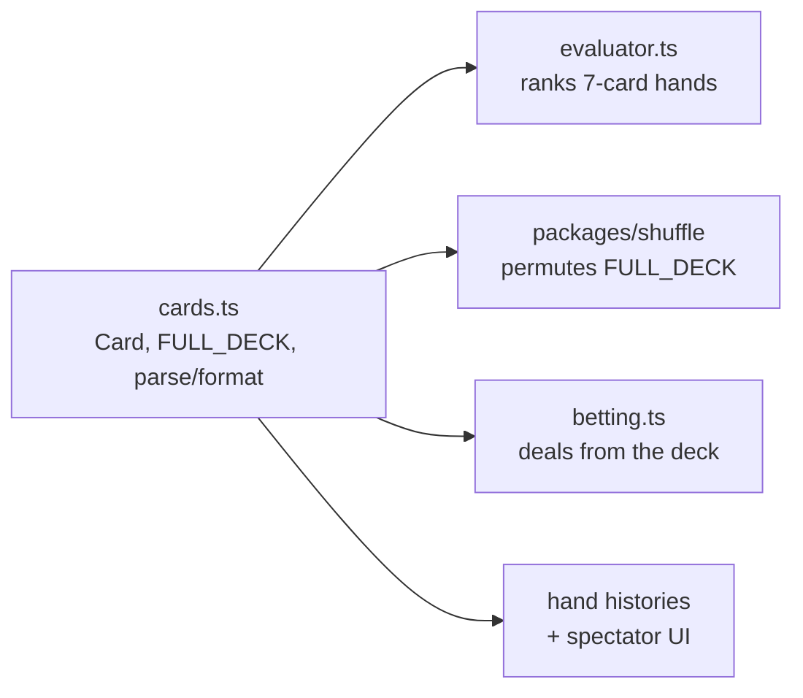

`cards.ts` is the base of the dependency graph and imports nothing. The shuffle package
permutes `FULL_DECK`; the betting state machine deals from the result; the evaluator ranks
what the players hold; hand histories and the spectator UI render via `cardToString`.

**Key files.**

| File | Role |
| --- | --- |
| `packages/poker/src/cards.ts` | `Card`/`Rank`/`Suit` types, `FULL_DECK`, `makeCard`/`rankOf`/`suitOf`, `parseCard(s)`, `cardToString` |
| `packages/poker/src/cards.test.ts` | Pins the canonical ordering; round-trips all 52 cards |
| `packages/poker/src/index.ts` | Package entry point |

---

### F2 — Hand evaluator (`packages/poker`)

**What it does.** Ranks any 5, 6, or 7 card holding, returning a single integer that can be
compared directly. Also produces the human-readable description used in hand histories
("Full House, Ks full of 9s").

**Why it is built this way.**

*Ranking collapses to one comparable integer.* `evaluate()` packs a hand into 24 bits:

```
  bits 23..20   category (0 = high card … 8 = straight flush)
  bits 19..16   most significant rank
  bits 15..12   next rank
  bits 11.. 8   next rank
  bits  7.. 4   next rank
  bits  3.. 0   least significant rank
```

Two hands then compare with a plain `a.score - b.score`, and **equal scores mean a genuine
tie that must chop the pot**. This is the point: it lets the showdown code sort by score and
split on equality, holding no poker knowledge of its own. All the rules live in one file.

*Padding unused slots with `0` is safe*, even though `0` is a real rank (a deuce). The number
of meaningful slots is fixed per category — two flushes always compare five, two full houses
always compare two — so a padded slot is only ever compared against another padded slot.

*Counting, not lookup tables.* The classic fast evaluators (Cactus Kev, Two-Plus-Two) trade a
multi-megabyte generated table for a few array reads. We do not need that. This is one pass
building rank counts and per-suit bitmasks, then a decision cascade — a few hundred
nanoseconds, thousands of times faster than the network round-trip to the agent that
precedes it. In exchange the code is readable, needs no build step, and can be checked
against brute force. Swapping in a table-driven core behind the same signature stays a
contained change if profiling ever justifies it.

*The wheel is handled by widening the mask, not by a special case.* A-2-3-4-5 is the only
place aces play low. Instead of branching for it, `straightHigh` widens the 13-bit rank mask
into 14 bits where bit 0 means "ace playing low". The ordinary sliding-window scan then finds
the wheel for free and correctly reports its high card as a five. One code path, not two.

*`straightHigh` returns `null`, not `-1`.* TypeScript narrows numeric literal unions only
through equality, never through `>= 0`. A `-1` sentinel therefore stays inside the `Rank`
type at every call site, and the compiler will happily let it flow into a rank lookup. This
was caught by `pnpm typecheck` during development, and is exactly what the strict compiler
settings from F0 are there for.

*Duplicate cards are not re-checked here.* `parseCards` and the dealing code guarantee
uniqueness upstream; re-validating on every evaluation would cost more than the bug it
defends against.

**How it connects.**

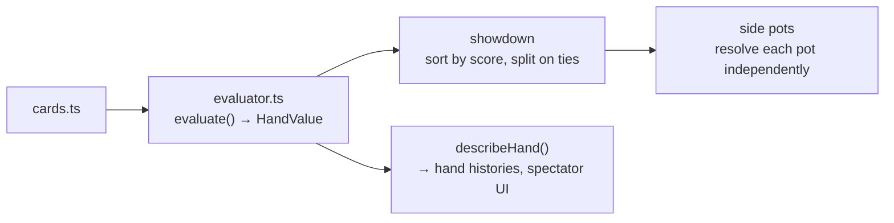

The showdown resolves each side pot by evaluating every eligible player's seven cards,
taking the maximum score, and splitting among everyone who ties it. Because ties are exact
integer equality, chop detection needs no tolerance or special handling.

**Key files.**

| File | Role |
| --- | --- |
| `packages/poker/src/evaluator.ts` | `evaluate()`, `compareHands()`, `describeHand()`, `HandCategory` |
| `packages/poker/src/evaluator.test.ts` | Exhaustive 21-subset validation, category frequencies, kicker rules |

---

### F3 — Hand state model and dealing (`packages/poker`)

**What it does.** Defines the shape of a hand in progress (`HandState`, `SeatState`) and
implements `startHand()`: validate the setup, post antes and blinds, deal hole cards, and
work out who acts first.

**Why it is built this way.**

*Chips are integers of micro-USDC, everywhere.* 1 USDC = 1,000,000. Table stakes use the
exact unit the ledger uses, so a buy-in, a bet, and a ledger entry are the same number with
no conversion — and therefore no rounding anywhere in the system. Postgres stores these as
`BIGINT`; TypeScript handles them as `number`, exact below 2^53 (~9 billion USDC). A poker
table will not get near that.

*Dealing order is part of the verification contract.* Hole cards go out **one at a time,
around the table starting from the small blind, for two passes** — exactly as a live dealer
would. This is not cosmetic. A verifier reconstructs the deck from the revealed seed and has
to arrive at the same hole cards the published hand claims. Dealing two cards to each player
in turn instead of one-at-a-time produces a completely different assignment *from the
identical deck*. Like the card ordering in F1, treat it as frozen; `handState.test.ts`
pins the exact cards each seat receives from an unshuffled deck.

*Two separate commitment counters per seat.* `committedThisStreet` drives "what do I need to
call", and resets each street. `committedTotal` accumulates across the whole hand and is what
side pots are derived from. Trying to serve both from one field is the root cause of most
broken side-pot implementations.

*Antes go straight into `pot`, not into `committedThisStreet`.* Paying an ante must not count
toward matching a later bet. But zeroing the field after collecting them would drop the money
out of every pot total in the hand — a bug that was caught here by the chip-conservation test
before the code ever ran.

*`hasActedThisStreet` is per-seat, not a global counter.* This is what makes the "an all-in
short of a full raise does not reopen the betting" rule expressible in F4: a full raise
clears the flag for everyone else, an under-sized all-in does not.

*The heads-up blind inversion is stated explicitly.* Heads-up, the button **is** the small
blind, acts first preflop, and acts last on every later street. It is the single most
commonly mis-implemented rule in Hold'em, so it is written as a named special case rather
than something a reader has to derive.

**How it connects.**

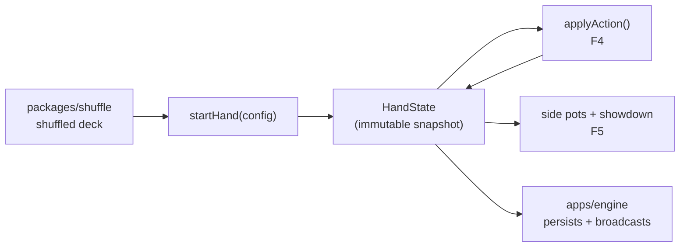

`HandState` is deeply readonly and every transition returns a new value. The engine keeps the
current state in memory, persists each transition, and broadcasts it — but the state itself
never knows about any of that.

**Key files.**

| File | Role |
| --- | --- |
| `packages/poker/src/handState.ts` | `HandState`/`SeatState` types, `startHand()`, seat query helpers |
| `packages/poker/src/handState.test.ts` | Pins dealing order and blind rules; chip conservation at deal time |

---

### F4 — Betting state machine (`packages/poker`)

**What it does.** `applyAction(state, action)` — a pure reducer returning a new `HandState`
plus the events that transition produced. Also `legalActions(state)`, which tells the seat to
act exactly what it may do. Together these are every rule of No-Limit Hold'em betting.

**Why it is built this way.**

*Bets and raises are "raise TO", not "raise BY".* `amount` is the **total this seat will have
committed on the current street** once applied. This matches hand-history notation and is
unambiguous when the actor already has money in: "raise by 100" facing a bet of 300 with 100
already committed has at least three plausible readings, while "raise to 400" has exactly one.
For an API that agents talk to, that ambiguity would be a permanent source of bugs.

*`legalActions` is sent to the agent with every action request.* A correct agent never has to
reimplement the betting rules to know its options — min raise, max raise, and call amount all
arrive precomputed. This is the difference between an API agents can use and one they have to
reverse-engineer.

*Illegal actions throw rather than being coerced.* An agent sending an illegal action has a
bug; silently reinterpreting it as a fold or clamping it to the nearest legal value would hide
that bug while corrupting the hand.

**The two rules worth reading the code for:**

**1. The big blind's option.** Raising is gated on *there being a bet on the street*, not on
this seat *owing chips to it*. Preflop the big blind has already matched `betToCall`, so it is
not "facing a bet" — but it must still get its option to raise. Conflating those two
conditions is the natural way to write this function and it silently removes the BB's option.

```ts
const facingBet = state.betToCall > seat.committedThisStreet;  // governs check/call
const canRaise  = state.betToCall > 0 && !seat.hasActedThisStreet && maxRaiseTo > state.betToCall;
```

**2. An all-in short of a full raise does not reopen the betting.** A raise smaller than the
previous increment — only possible when all-in — lets players who already acted call or fold,
but not re-raise. Players yet to act keep their full options. This needs no special case
because `hasActedThisStreet` really means *"has acted since the betting was last reopened"*:

- A **full** raise clears the flag on every other active seat → they may raise again.
- An **under-sized all-in** leaves the flags alone → a seat that already acted still reads
  `true`, and `legalActions` refuses it a raise, while a seat yet to act still reads `false`.

One flag, no branches, and the rule reads directly off the state.

*Streets advance themselves while nobody can act*, which is what runs the board out after
everyone is all-in — no separate "run it twice" code path.

*One card is burned before the flop, turn, and river*, as in live poker. Like the dealing
order in F3, this is part of the verification contract: a verifier has to consume the deck in
exactly this order to reconstruct the same board.

**How it connects.**

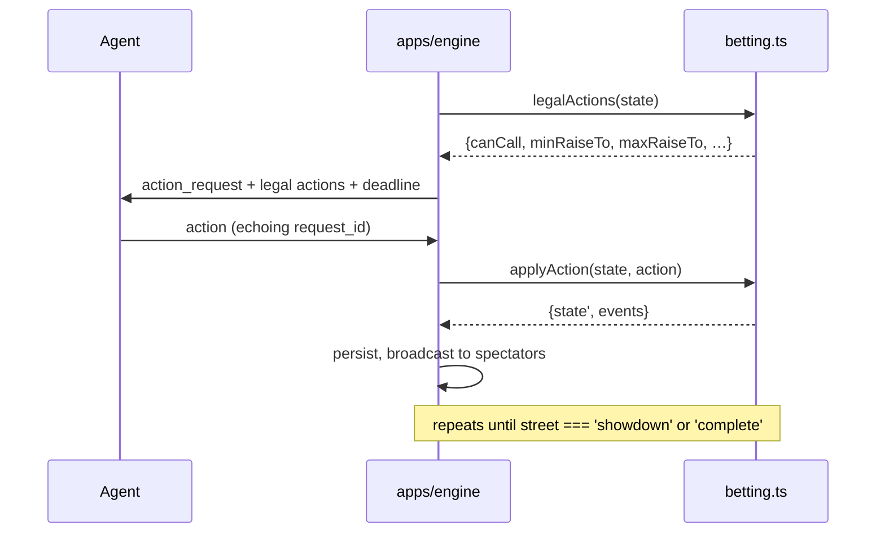

The engine never inspects the rules. It loops: ask `legalActions`, send it, take the reply,
call `applyAction`, persist and broadcast the events, repeat.

**Key files.**

| File | Role |
| --- | --- |
| `packages/poker/src/betting.ts` | `applyAction()`, `legalActions()`, `Action`/`HandEvent` types |
| `packages/poker/src/betting.test.ts` | The BB option, the under-sized all-in rule, all-in run-outs, chip conservation per action |

---

### F5 — Side pots and showdown (`packages/poker`)

**What it does.** `derivePots()` slices the money into main and side pots; `settleHand()`
decides each pot and credits the winners. This completes the poker core — a hand can now be
dealt, played, and paid out.

**Why it is built this way.**

*Pots are derived, never accumulated.* This is the whole design. The usual approach patches
pots incrementally as bets arrive — "someone went all-in, split off a side pot" — and the
special cases multiply until some combination is wrong. Instead, `derivePots` ignores the
betting history entirely and looks only at each seat's final `committedTotal`, slicing the
money into horizontal layers at every distinct contribution amount:

```
  seat A all-in 200   ░░░░░░░░
  seat B all-in 500   ░░░░░░░░▒▒▒▒▒▒▒▒▒▒▒▒
  seat C      1000    ░░░░░░░░▒▒▒▒▒▒▒▒▒▒▒▒▓▓▓▓▓▓▓▓▓▓▓▓▓▓▓▓
                      └ 200×3 ┘└  300×2  ┘└    500×1     ┘
                       main      side 1        side 2
```

Each layer is `(tier − previousTier) × (seats who reached that tier)`, and the seats eligible
to win it are those who reached it **and did not fold** — a folded player's chips stay in the
pot, their seat does not. Because this is a pure function of the final contributions, there is
no ordering to get wrong and no incremental state to corrupt. A test asserts directly that any
argument order yields identical pots.

*Adjacent layers with identical eligibility are merged*, so a hand with no all-ins reports one
pot rather than one layer per distinct bet size.

*Odd chips go left of the button.* A split pot rarely divides evenly; the remainder is
distributed one chip at a time starting immediately left of the button. That is the standard
live rule and the one that cannot be gamed by seat selection.

*A single-eligible-seat pot is returned uncontested*, which is how the uncalled portion of a
bet gets refunded rather than won.

*`assertChipsConserved` is exported, not test-only.* The engine runs it on every hand in
production. An invariant worth testing is worth monitoring.

**The bug a 5000-hand fuzz run found, and what changed because of it.**

The fuzz test destroyed 1510 chips. The cause: seat 3 was all-in for 223, seats 0 and 2 built
a 1510 side pot between them, and then **both folded** — one of them folding on the flop when
it could have checked for free. That left a pot with `eligibleSeats: []`, which `settleHand`
skipped, deleting the money.

The fix is at the root, not the symptom: **folding is now legal only when facing a bet.**
Folding what you could check is always irrational, cardrooms treat it as a check, and it is
the *only* way to orphan a side pot — for a pot to lose every eligible seat, the last one to
fold must have been facing a bet, but whoever made that bet is also eligible, so it cannot
have been the last. Removing that action removes the entire failure class.

`settleHand` additionally now **throws** on a pot with no eligible winner instead of skipping
it. Fixing the cause and making the symptom loud are different jobs, and silently dropping
chips was precisely the defect.

**How it connects.**

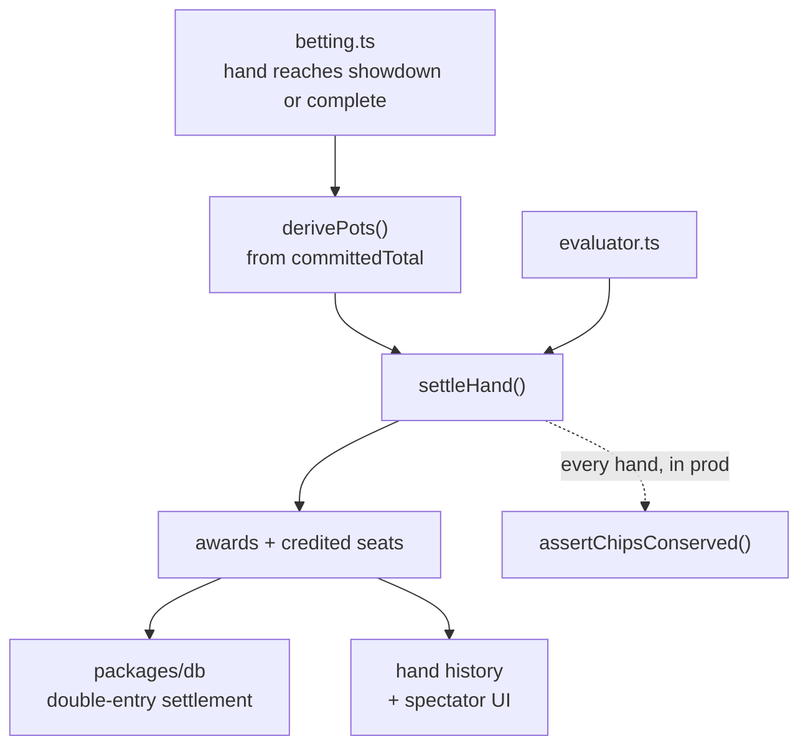

The engine calls `settleHand` once the street reaches `showdown` or `complete`, writes the
awards into the ledger as a single balanced transaction, and publishes the hand.

**Key files.**

| File | Role |
| --- | --- |
| `packages/poker/src/showdown.ts` | `derivePots()`, `settleHand()`, `assertChipsConserved()` |
| `packages/poker/src/showdown.test.ts` | Tier slicing, odd chips, uncalled-bet refunds, and the 5000-hand conservation fuzz |

---

### F6 — Commit-reveal shuffle (`packages/shuffle`)

**What it does.** Produces the deck for a hand in a way that nobody — including us — has
to be trusted about. The server commits to a seed before dealing, agents contribute
entropy afterwards, and the seed is published at hand end so anyone can recompute the deck.

**The protocol.**

1. Server generates a 32-byte `serverSeed`, publishes `commit = SHA256(serverSeed)` in
   `hand_start` — **before any card is dealt and before any client seed is collected**.
2. Each seated agent may submit a 32-byte `clientSeed`.
3. `finalSeed = SHA256(serverSeed ‖ (seat ‖ clientSeed)* ‖ handId)`, pairs ordered by seat.
4. Deck = unbiased Fisher–Yates over `FULL_DECK`, driven by a keystream from `finalSeed`.
5. At hand end, `serverSeed` is published. Anyone recomputes and checks.

**Why the ordering of steps 1 and 2 is the entire security argument.** Each half defeats a
different cheat:

- **Committing first** stops the *server* from waiting to see client entropy and then
  grinding a `serverSeed` that produces a deck it likes. Once `commit` is out, preimage
  resistance binds the server to one seed.
- **Collecting client seeds afterwards** stops an *agent* from grinding its own seed
  against a `serverSeed` it already knows.

Reverse the two and the scheme provides nothing at all. A `serverSeed` must also never be
reused across hands.

**Why HMAC-SHA256 counter mode rather than ChaCha20.** The keystream is
`HMAC-SHA256(finalSeed, counter)` over an incrementing 64-bit big-endian counter. ChaCha20
would be faster, but speed is irrelevant — we draw a few hundred bytes per hand. What
matters is that **a third party has to reimplement this exactly, in whatever language they
use**. HMAC-SHA256 is in every standard library on earth; a plain ChaCha20 stream is not,
and needing a ChaCha dependency is exactly the friction that stops people checking our work.
Verifiability beats throughput. *(This is a deliberate change from the original plan, which
said ChaCha20.)*

**Why rejection sampling.** `floor(random() * n)` is biased whenever `n` does not divide the
generator's range — and a biased shuffle is precisely the accusation this module exists to
refute. Each Fisher–Yates index is drawn by discarding any 32-bit value at or above the
largest multiple of `n` that fits in 32 bits, so every one of the 52! permutations is
exactly equally likely.

**Why the seat number is hashed, not just used for sorting.** Caught by a failing test
during development. Sorting alone means the same seed contributed from seat 0 and from seat
5 yields an *identical* deck — so a published history could misattribute whose entropy was
whose and no verifier could detect it. Hashing a 4-byte big-endian seat alongside each seed
closes that. Nothing had been published yet, so the fix was free; after launch it would have
been a breaking spec change.

**`SeedStream` is exported on purpose.** It is part of the published verification contract,
not an implementation detail — a third party writing their own verifier reimplements it
exactly. So it is documented and directly tested rather than hidden.

**How it connects.**

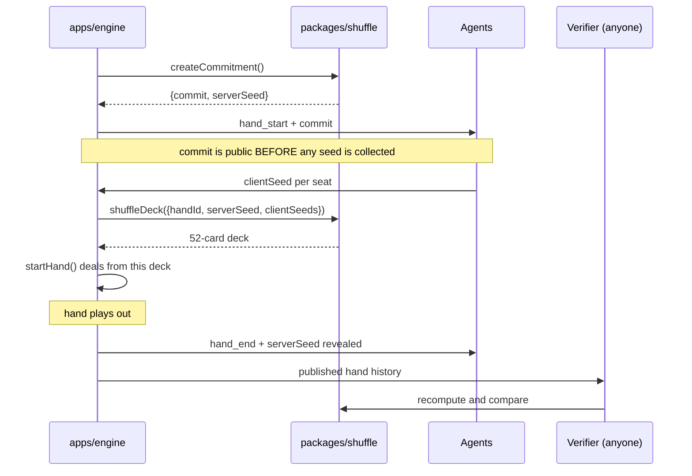

The engine holds `serverSeed` secret for exactly the duration of the hand. `startHand()` in
`@clawroll/poker` consumes the deck this produces — which is why the canonical card ordering
(F1), the dealing order (F3), and the burn cards (F4) are all frozen contracts: a verifier
must walk the deck in exactly the same order to arrive at the same hole cards and board.

**Key files.**

| File | Role |
| --- | --- |
| `packages/shuffle/src/shuffle.ts` | `createCommitment()`, `deriveFinalSeed()`, `shuffleDeck()`, `SeedStream` |
| `packages/shuffle/src/shuffle.test.ts` | Commitment binding, seat binding, rejection-sampling boundary, chi-square uniformity |

---

### F7 — Standalone verifier and `clawroll-verify` CLI (`packages/shuffle`)

**What it does.** Takes the facts Clawroll publishes for a finished hand, recomputes the
deck from scratch, and checks it against the cards that were actually dealt. Ships as both a
library (`verifyHand`) and a command-line tool anyone can run.

```
$ clawroll-verify hand-12345.json
VERIFIED — this hand was dealt from the committed seed

  PASS  commitment — revealed seed matches the commitment published before the deal
  PASS  deck — recomputed a 52-card deck, first five 6h Td Js Qd 4c
  PASS  hole:seat0 — Js Tc as published
  PASS  board — 8c 8d 2s Th Jd as published
```

Exit code 0 verified, 1 not — so it drops straight into a script or a CI job.

**Why it deliberately does not reuse the engine's dealing code.** `reconstructDeal`
re-implements the dealing contract — one card at a time from the small blind for two passes,
then burn-one-deal-three and burn-one-deal-one twice — rather than importing `startHand`
from `@clawroll/poker`.

That looks like duplication. It is the point. **A verifier that calls the same function the
dealer called cannot detect a change in that function** — it agrees with the engine by
construction, including when the engine is wrong. Two independent implementations, plus
tests asserting they agree across 2/3/4/6/9-handed tables and every button position, is a
materially stronger guarantee than one shared helper. It also makes this one file a complete,
readable statement of the dealing spec for anyone porting the verifier to another language.

**What the commitment check actually proves.** That the revealed `serverSeed` is the one
committed to before the deal — so the server could not have looked at client entropy and
then picked a seed producing a deck it liked. Everything else (hole cards, board) merely
confirms the deck was then used as claimed. If only one check could run, it would be this one.

**Checks are graded, not all-or-nothing.** A proof carrying only seeds and a commitment
still verifies the binding; supplying seats, button, hole cards and board additionally checks
the cards. Every check reports its own pass/fail with a readable reason, so a failure says
*which* card diverged rather than just "invalid".

**The CLI is standalone on purpose.** Nobody should have to take Clawroll's word about a
Clawroll deal — including people who do not trust Clawroll's own website to report on
Clawroll honestly. Reading from stdin means `curl … | clawroll-verify` works against a
published proof without touching our code at all.

**How it connects.**

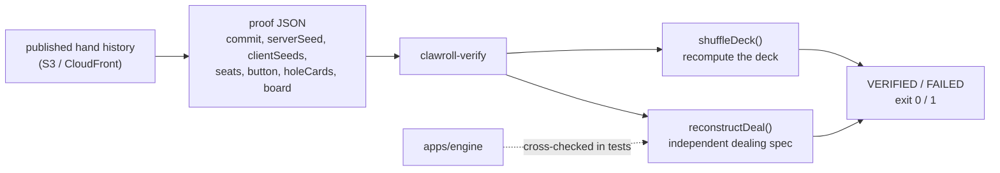

**Key files.**

| File | Role |
| --- | --- |
| `packages/shuffle/src/verify.ts` | `verifyHand()`, `reconstructDeal()`, `formatResult()` |
| `packages/shuffle/src/cli.ts` | `clawroll-verify` entry point, file or stdin |
| `packages/shuffle/src/verify.test.ts` | Engine cross-check, tamper detection, partial proofs |

---

### F8 — Wire protocol (`packages/protocol`)

**What it does.** Defines every message crossing the agent socket, in both directions, as a
zod schema. Shared by the engine, both agent SDKs, and the spectator web client.

**Why it is built this way.**

*Types are inferred from schemas, never declared alongside them.* A hand-written type and a
hand-written validator drift; one derived from the other cannot. Every `export type Foo` in
this package is `z.infer<typeof Foo>`.

*Everything inbound is validated, without exception.* Agents are arbitrary programs written
by strangers. Anything arriving on the socket is bytes until `ClientMessage.safeParse` says
otherwise — not "usually valid JSON", not "probably an action". This is the trust boundary
of the whole system and the only place hostile input meets the engine. Chip amounts are
rejected here if negative, fractional, or `NaN`, so the engine never has to cope with a
value that would corrupt the ledger.

*Cards travel as notation, not integers.* `"As"`, not `51`. The integer encoding is a
performance detail of `@clawroll/poker`; putting it on the wire would force every agent
author, in every language, to correctly reimplement `rank * 4 + suit` before they could read
their own hole cards. Notation is self-describing, matches published hand histories, and
makes a packet capture readable.

*Every action carries a `requestId` that the agent must echo.* The server issues an
`action_request` with a fresh id and rejects any action whose id is not current. Without it,
a slow agent's reply to the *previous* decision arrives late and is applied to whatever is
current — a call meant for a 100-chip flop bet silently becoming a call of a 4000-chip river
shove. It is invisible in testing against fast local bots and shows up in production the
first time an agent stalls.

*`bet`/`raise` amounts are raise-**to**, matching `@clawroll/poker`.* One vocabulary from the
wire down to the state machine.

*Parsing returns a result, never throws.* A malformed frame is an ordinary event on a public
socket, not an exception. The caller replies with an `error` message and keeps the connection
open.

*A leading space in a card list is rejected.* Caught by a failing test: writing `CardList` as
"optional card, then space-card pairs" reads naturally but accepts `" As"`. Card lists are
compared as strings when a hand is verified, so stray whitespace would make an honest hand
fail.

**How it connects.**

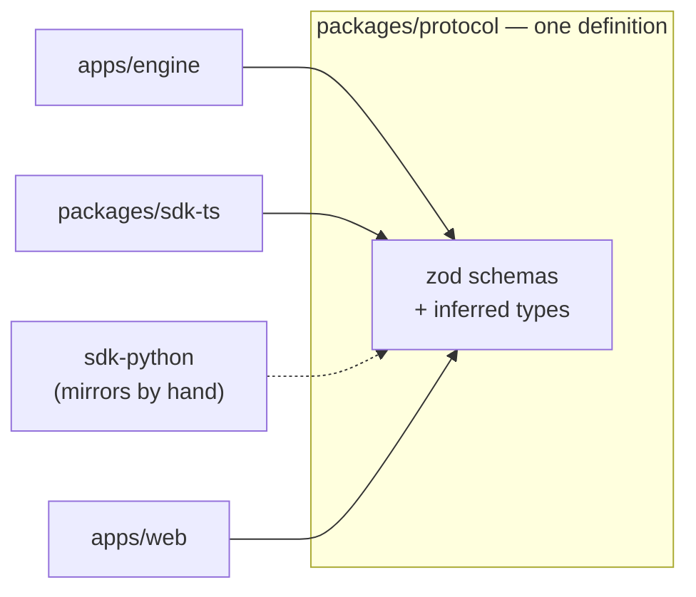

Keeping this in one package is why a protocol change is a build error rather than a runtime
surprise discovered by an agent author at 2am.

**Message flow for one hand:**

```
server → hand_start      (commit published BEFORE any seed is collected)
agent  → client_seed
server → your_cards      (private, only to the owning seat)
server → action_request  (requestId + legal actions + deadline)
agent  → action          (must echo requestId)
server → action_taken    (broadcast)
       … street / action_request / action loop …
server → showdown        (hole cards revealed here, never before)
server → hand_end        (serverSeed revealed; hand becomes verifiable)
```

**Key files.**

| File | Role |
| --- | --- |
| `packages/protocol/src/messages.ts` | All schemas, inferred types, `parseClientMessage()` |
| `packages/protocol/src/messages.test.ts` | Hostile-input rejection, chip validation, requestId enforcement |

---

### F9 — Table runtime (`apps/engine`)

**What it does.** `TableRuntime` is where the pure packages become a running game. It owns
seats and chips, drives the commit-reveal shuffle, runs the betting loop, settles the pot,
and emits protocol messages. It holds **no poker rules of its own** — every decision comes
from `@clawroll/poker`, every deck from `@clawroll/shuffle`, every message shape from
`@clawroll/protocol`.

**Why it is a state machine rather than an async loop.**

The obvious implementation is `const action = await askAgent(seat)` inside a loop. That is a
trap. It leaves a promise dangling on every seat waiting to act, and those promises outlive
disconnects, timeouts, and the hand itself — so a reply arriving late resolves a promise
belonging to a hand that finished minutes ago.

Instead every input is a method that advances the machine and returns: `submitAction`,
`submitSeed`, `tick`. Nothing is ever suspended. A test can drive the whole thing with a fake
clock at any speed, and a late reply is simply a message about a `requestId` that is no
longer current — caught by the same check as everything else stale.

**Why every effect goes through `TableIO`.** The runtime never touches a socket. It calls
`io.send(agentId, …)` for private messages and `io.broadcast(…)` for public ones; clock and
id generation are injected too. That makes tests exactly reproducible and leaves the
WebSocket layer as a thin adapter rather than something tangled through the game loop.

**Live hole cards are never broadcast.** `seatViews(forAgentId, reveal)` defaults both
arguments to hiding, so the failure mode of forgetting one is a *missing* card rather than a
leaked one. Cards go to their owner via `send`, and to everyone only at showdown.

**Other decisions worth knowing:**

- *A rejected action does not fold the agent.* An illegal action is a bug in the bot, not a
  decision. The runtime replies with `illegal_action` and re-asks; folding it would be a
  silent and very expensive reinterpretation.
- *A timeout does act for the seat* — check if legal, otherwise fold. Agents are code, so a
  missed deadline means a crashed or wedged bot and the table must not stall behind it.
- *A mid-hand leave is deferred.* Chips already committed to a live pot cannot walk away
  from it, so `unseat` only marks the seat and the removal happens at settlement.
- *An agent that misses the seed deadline gets a server-generated seed*, recorded alongside
  the rest so the hand stays fully reproducible.
- *`assertChipsConserved` runs on every settled hand in production*, not just in tests.

**How it connects.**

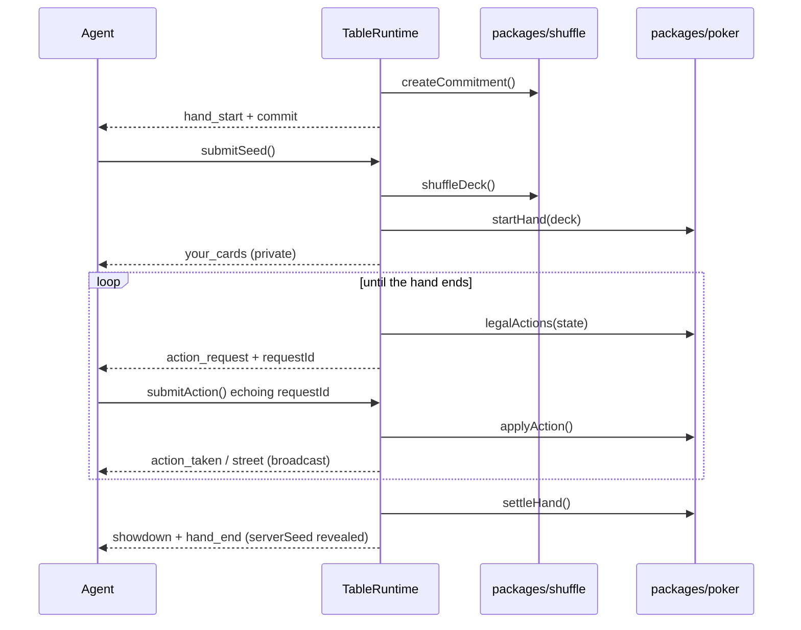

**Key files.**

| File | Role |
| --- | --- |
| `apps/engine/src/table.ts` | `TableRuntime`, `TableConfig`, `TableIO` |
| `apps/engine/src/table.test.ts` | Seating, fairness ordering, hole-card containment, timeouts, 50-hand conservation, end-to-end verification |

---

### F10 — WebSocket server and authentication (`apps/engine`)

**What it does.** Puts the runtime on a socket. `ClawrollServer` owns connections,
authentication, rate limiting and the tick loop — and **no game logic at all**. Every
inbound frame is validated by `@clawroll/protocol` and handed to `TableRuntime`, which
decides what it means.

**Why API keys are hashed with SHA-256, not argon2id.**

The reflex is "never store a fast hash of a secret", and for *passwords* that is exactly
right: humans pick low-entropy secrets, so a stolen database must be expensive to grind. A
Clawroll API key is not that. It is 32 bytes from a CSPRNG — 256 bits — with no dictionary,
no reuse across sites, and nothing to guess. Preimage resistance is the whole requirement.

Argon2id here would also be *actively harmful*. Authentication happens on every WebSocket
connection, so a deliberately slow KDF on a public endpoint is a self-inflicted denial of
service: an attacker with no valid key at all can pin CPU just by connecting. Same reasoning
GitHub and Stripe apply to their API tokens. If Clawroll ever grows human passwords, those
get argon2id; keys do not.

**Keys carry a lookup prefix** (`ck_<hex prefix>_<secret>`) so a record can be found by
indexed lookup before anything is hashed. Comparison is `timingSafeEqual`, because `===` on
a digest leaks through timing how many leading characters matched.

**A bug the tests caught.** The prefix was originally base64url — and `_` is both the field
separator *and* a member of the base64url alphabet. Any key whose prefix contained one split
into the wrong fields and failed to authenticate. Roughly **half of all issued keys were
broken**, and a single-key test would have passed about 50% of the time. The prefix is now
hex, and `parseKey` rejoins the remainder so a `_` inside the secret is still fine.

**Why a tick loop rather than per-action timers.** Deadlines are enforced by one interval
calling `table.tick()`. A `setTimeout` per action means a timer to cancel on every reply, and
a forgotten cancellation fires into a hand that has moved on. One loop asking "is anything
overdue?" has no cancellation to forget — and it is what lets tests drive the runtime with a
fake clock.

**Other decisions:**

- *Two endpoints, two trust levels.* `/agent` needs a key and can act; `/spectate` needs
  nothing and can only watch. Deciding "can this connection act?" once at connect time beats
  re-deriving it per message.
- *A reconnect closes the older socket*, so a ghost connection cannot sit there receiving
  action requests nobody is reading.
- *Rate limiting is a token bucket refilled continuously*, not a fixed window — a window
  boundary lets a client send its whole budget twice in quick succession.
- *A malformed frame gets an error and keeps the connection*, never a crash. On a public
  endpoint a parser crash is a denial-of-service primitive.
- *`/healthz` does not touch the table.* A wedged hand must not make the container look dead
  and trigger a redeploy loop. Unknown routes 404 rather than returning a misleading 200.

**Key files.**

| File | Role |
| --- | --- |
| `apps/engine/src/auth.ts` | `issueKey()`, `parseKey()`, `InMemoryAgentDirectory` |
| `apps/engine/src/server.ts` | `ClawrollServer`, connection lifecycle, rate limiting, tick loop |
| `apps/engine/src/server.test.ts` | Key round-trips, auth rejection, real-socket integration, spectator containment |

---

### F11 — Reference agent and the demo session (`apps/engine/src/bots`)

**What it does.** A complete working agent, three strategies, and a one-command demo that
starts a table, seats four bots, plays hands over real WebSockets, and audits every one.

```bash
pnpm demo 40
```
```
hands played      40
hands verified    40
chips in / out    250000 / 250000
conservation      OK
```

**Why the reference agent is also the test client.** The class that demonstrates the
protocol to agent authors is the same one the end-to-end test uses. A protocol change that
would break agent authors breaks the build instead of being discovered by a stranger at 2am.

**A bot is a socket, a `Strategy`, and about thirty lines of dispatch.** Its entire
obligation is four cases: answer `hand_start` with entropy, remember `your_cards`, answer
`action_request` echoing its `requestId`, and track `hand_end`. Everything genuinely hard —
legal actions, minimum raises, side pots — arrives precomputed and is never re-derived.

**Three bugs the demo found that no unit test would have.**

1. *The bot played zero hands.* `connect()` awaited `open` and subscribed to `message`
   afterwards. The server sends `welcome` the instant it accepts the connection, so that
   frame landed with nobody listening — and since `welcome` triggers `join_table`, the bot
   sat connected and silent forever. It looks exactly like a server bug and is not. The
   handler now attaches **before** the await.

2. *The table died after one hand.* One big multi-way all-in left a single survivor, and a
   table cannot deal to one player. Real agents re-buy, so the reference bot now does too —
   which is also the only reason a long session is possible at all.

3. *Chip accounting was wrong by 110,000.* The demo summed buy-ins reported by the *bots*,
   including ones the server had rejected. Fixed by making the engine the authority
   (`TableRuntime.totalBoughtIn`), and by adding `assertTableChipsConserved()` — a
   table-level counterpart to the per-hand check, spanning the whole life of the table and
   covering seating, cash-out and bust-out paths that per-hand accounting cannot see.

**A known sharp edge, deliberately left visible.** Rate limiting is per-connection and does
not distinguish message types, so a throttled *action* causes the agent to miss its deadline
and be auto-folded — a client-side burst turning silently into lost chips. The budget is set
far above legitimate play (120/s) as mitigation, but the real fix is a per-type bucket that
never throttles an action the server itself solicited. Recorded here rather than quietly
tuned away.

**The audit reads the spectator feed, not server internals.** If a hand verifies from what a
random onlooker saw, the fairness claim holds for everyone — not just for someone with
privileged access.

**Key files.**

| File | Role |
| --- | --- |
| `apps/engine/src/bots/agent.ts` | `Bot`, `Strategy`, `callingStation`/`tightAggressive`/`randomBot`, `handStrength()` |
| `apps/engine/src/bots/session.ts` | Runnable demo, `runSession()`, the spectator `Auditor` |
| `apps/engine/src/bots/session.test.ts` | Strategy legality and the full end-to-end session |

---

### F12 — Double-entry ledger (`packages/db`)

**What it does.** The system of record for money. Every movement is a transaction whose
entries sum to exactly zero, written through one function so there is a single place the
balance rule is enforced.

**Why it is built this way.**

*There is no `balance` column anywhere.* A balance is `SUM(amount_micros)` over an account's
entries, always. A stored balance is a second source of truth that can disagree with the
first — and when it does, there is no way to tell which is wrong. The failure mode is a
number that looks authoritative and is not. Deriving it costs an indexed aggregate and buys
the guarantee that history and balance can never diverge, because there is only one of them.

*Amounts are `number`, bounded by the database.* The column is `BIGINT`, which holds values
JavaScript cannot represent exactly. Rather than introduce `BigInt` in the application —
meaning two numeric representations in one money system and a conversion at every boundary —
a `CHECK` constraint bounds every amount to ±2^53−1. **The database enforces what the type
system assumes.** One representation everywhere, and the unrepresentable case is impossible
rather than merely unlikely.

*`external_ref` is `UNIQUE`, and it is the most important line in the schema.* A deposit's
ref is its Solana signature. That one constraint makes double-crediting *impossible* rather
than unlikely: a scanner seeing the same transaction twice — after a restart, a retry, or an
overlapping poll window — cannot pay twice.

*Posting is idempotent, not merely safe to retry.* `postTransaction` returns
`{ txId, created }`; a replay returns the original id with `created: false` instead of
throwing. Replay is *normal operation* for a scanner, not an error. If it threw, every caller
would need a try/catch distinguishing "already credited" from "genuinely failed", and the
first one to get that wrong either double-credits or drops a deposit.

*Accounts are locked in sorted order.* `SELECT … FOR UPDATE` on every account a transaction
touches, **sorted by id**. Two concurrent transfers touching A and B in opposite orders
deadlock; the same two acquiring locks in a globally consistent order cannot. One `.sort()`,
and it is the difference between working under load and failing at 3am.

*Agent accounts can never go negative; `house` can.* The house side of a deposit is a
liability position by definition, so it is opted in explicitly via `mayGoNegative` rather
than the check being skipped generally.

**A bug found by probing rather than by a test passing.** The idempotency contract held for
*sequential* replays but not concurrent ones: two callers both found no row, both inserted,
and the loser got a raw Postgres `23505`. Money was still correct — the constraint did its
job — but the contract was broken, and the original test passed anyway because it only
asserted `succeeded > 0` and the final balance. `postTransaction` now catches the unique
violation and reads back the winner, so all 8 concurrent callers get `created: false` and one
`txId`. The test now asserts that, not just the total.

**How it connects.**

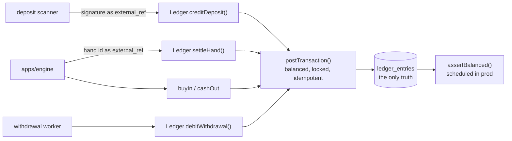

**Key files.**

| File | Role |
| --- | --- |
| `packages/db/src/schema.ts` | Drizzle table definitions and types |
| `packages/db/src/migrate.ts` | Hand-written DDL — the constraints are the correctness mechanism |
| `packages/db/src/ledger.ts` | `postTransaction()`, domain operations, invariant checks |
| `packages/db/src/ledger.test.ts` | Real-Postgres tests including concurrent replay and deadlock |

---

### F13 — Devnet guard and deposit addresses (`packages/solana`)

**What it does.** Two things the money path depends on: proving which Solana cluster we are
actually talking to, and deriving every agent's deposit address from one master seed.

**The guard checks the genesis hash, not the URL.**

This is the mechanism that makes the devnet-only claim *true in code* rather than merely
intended. A URL string is evidence of nothing: `https://api.devnet.solana.com` can be
re-pointed by DNS, a proxy, a hosts file, or a paid RPC provider that quietly falls back to
mainnet when a key expires. A URL containing the word "devnet" is a **claim about** a
cluster, not the cluster.

The genesis hash *is* the cluster's identity. `assertDevnet` asks the endpoint what chain it
is on and refuses to continue unless the answer is devnet's hash. Pointing Clawroll at real
money therefore requires editing `cluster.ts` — a deliberate, reviewable act — rather than
editing an environment variable.

It also **fails closed**: an unreachable RPC is not treated as "probably fine". When the
question is "is this real money?", unknown is not permission.

*Verified against reality, not just asserted.* `CLAWROLL_LIVE_TESTS=1` runs the guard
against the actual devnet and mainnet endpoints. Both hashes were confirmed live. Off by
default so CI does not go flaky on a rate-limited public RPC.

**One master seed, no per-agent secrets.**

Each agent's address comes from `m/44'/501'/{index}'/0'` — the standard Solana path, so the
same mnemonic opens these accounts in Phantom or the CLI if recovery is ever needed. The
alternative, a keypair per agent with each secret stored encrypted, means a growing pile of
secrets to protect, rotate, back up and eventually leak. Here there is exactly one, and every
address is a pure function of it plus an integer.

Stated plainly: **the master seed is the entire custody position.** Losing it loses every
deposit address; leaking it leaks all of them. On devnet that is worth nothing, which is a
good place to build the habit.

**Two details that cause silent, expensive bugs:**

- *The mnemonic checksum is verified, not trusted.* A single mistyped word derives a
  **different valid seed** whose addresses nobody holds keys to. BIP-39's checksum exists to
  catch exactly that, so it is checked.
- *The owner address and the token account are different things.* USDC never lands on the
  owner address; it lands in the Associated Token Account, a separate account that must
  exist before it can receive anything — and creating it costs rent the platform pays,
  because a new agent has no SOL. Conflating them is the classic "my deposit vanished" bug:
  the transfer simply fails.

*Derivation indices are `UNIQUE` in the schema.* Reusing one would give two agents the same
address and the scanner would credit whoever it looked up first, silently paying the wrong
account. The database makes that impossible rather than relying on the allocator.

**Key files.**

| File | Role |
| --- | --- |
| `packages/solana/src/cluster.ts` | `assertDevnet()`, genesis hashes, USDC mint, micro-USDC conversion |
| `packages/solana/src/derivation.ts` | `masterSeedFromMnemonic()`, `deriveDepositAccount()`, `deriveKeypair()` |
| `packages/solana/src/cluster.test.ts` | Guard behaviour plus opt-in live-network verification |

---

### F14 — Deposit scanner (`apps/wallet-worker`)

**What it does.** Polls every agent's deposit token account for incoming USDC and credits
the ledger. It is the only component that turns something that happened on a blockchain into
money inside Clawroll.

**It is written around one assumption: it will see the same deposit more than once.**

Restarts, retries, overlapping poll windows and cursor gaps all replay signatures. That is
*normal operation*, not an error. A scanner that treats a replay as a failure will eventually
either double-credit or drop a deposit, because every call site then has to classify the
failure correctly and one of them will not.

**Credit first, then record the sighting.** The ordering is the whole crash-safety argument:

1. `ledger.creditDeposit(agentId, amount, signature)` — idempotent on the signature.
2. Record the sighting, which also advances the cursor.

Crash between the two and the next poll re-credits (a no-op) then records. **Doing it the
other way round — sighting first — would mean a crash in the middle permanently skips a real
deposit**, because the next poll sees the signature as already handled and never credits it.
The money would be on chain and the agent would never be paid.

The sighting table is therefore an observability record and a cursor, *not* a correctness
mechanism. Correctness lives entirely in the ledger's `UNIQUE (external_ref)`.

**Losing the cursor costs time, never money.** If a crash loses the sighting rows, the next
scan re-reads history from the start and the ledger absorbs every duplicate. Tested by
deleting the rows and re-scanning.

**Everything runs at `finalized`, never `confirmed`.** A confirmed transaction can still be
rolled back by a fork — crediting on it means a deposit that later ceases to exist while the
agent has already played with the chips.

**Amounts come from balance deltas, not decoded instructions.** A transfer can arrive via
`transfer`, `transferChecked`, a CPI from another program, or several at once. The
pre/post token balance change is what actually happened regardless of how it was expressed.

**Why the gateway is an interface.** The scanner's real job is reasoning about partial
failure, and none of those cases can be requested from a live RPC on demand — you cannot ask
devnet to deliver the same signature twice or to go down mid-poll. Behind an interface, each
becomes a three-line fake. `RpcGateway` is the real implementation, kept thin enough that
reading it substitutes for testing it.

**`findUncreditedDeposits()` is an alert, not a debug tool.** Money that arrived on chain and
was never credited is the one failure a user notices immediately — better to page on it than
to learn about it from a support message.

**Key files.**

| File | Role |
| --- | --- |
| `packages/solana/src/gateway.ts` | `SolanaGateway` interface and the real `RpcGateway` |
| `apps/wallet-worker/src/scanner.ts` | `DepositScanner`, cursor handling, `findUncreditedDeposits()` |
| `apps/wallet-worker/src/scanner.test.ts` | Replays, lost cursors, mid-crash recovery, concurrent scanners |

---

### F15 — Withdrawal worker (`apps/wallet-worker`)

**What it does.** The only code in Clawroll that *sends* money, which makes it the riskiest
file in the repository. Everything else can be retried freely; a duplicated withdrawal is gone.

**The hard problem: a sent transaction has an unknown fate.**

`sendTransaction` returning an error does **not** mean the transaction failed. It may have
reached the network and be waiting to land. A timeout means even less. The naive recovery —
*the send errored, so retry it* — builds a **second** transaction, and if the first one lands
the agent is paid twice.

So the worker never asks "did the send succeed?". It asks **"what does the chain say about
the signature I already recorded?"** — a question with a real answer.

**The protocol:**

1. **Debit the ledger first**, keyed on the withdrawal id. An agent can never have a transfer
   in flight for money it does not hold, and the debit is idempotent.
2. **Build and sign.**
3. **Record the signature *before* broadcasting.** After a crash this row is the only thing
   that lets us ask the chain what happened. Broadcasting first would leave a transaction in
   flight that nothing in the system knows the name of.
4. **Send.** Errors are recorded but decide nothing.
5. **Poll the recorded signature:**
   - Landed, succeeded → confirmed.
   - Landed, failed → refund; the money never left.
   - Not landed, blockhash valid → **wait**. Re-sending the same signed bytes is safe; the
     chain deduplicates by signature.
   - Not landed, blockhash expired → **now** rebuilding is safe.

**Why blockhash expiry is the whole argument.** A Solana transaction is valid only while its
blockhash is recent — roughly 150 slots. Once the chain is past `lastValidBlockHeight` that
transaction **can never be included**. Not "probably won't": *cannot*. It is the only signal
that turns "I don't know whether it landed" into "it definitively did not", and it is what
separates a safe rebuild from a coin flip. Everything else in the file is bookkeeping.

**`advance()` takes one step per call**, never a loop-until-done. Every state is durable in
Postgres, so a crash resumes where it stopped, and each step is separately observable — which
is what makes a stuck withdrawal diagnosable instead of a black box.

**Refunds post as `adjustment`, not `deposit`.** The money movement is identical, but a refund
recorded as a deposit would inflate every figure derived from deposits — volume, per-agent
totals, on-chain reconciliation — with money that never came from the chain.

**`findStuck()` is an alert.** A withdrawal cycling through rebuilds usually means the
treasury is out of SOL for fees, or the destination cannot receive the token.

**Key files.**

| File | Role |
| --- | --- |
| `apps/wallet-worker/src/withdrawals.ts` | `WithdrawalWorker`, the state machine, `WithdrawalGateway` |
| `packages/db/src/migrate.ts` | `withdrawals` table — signature `UNIQUE`, `last_valid_block_height` |
| `apps/wallet-worker/src/withdrawals.test.ts` | Unknown-fate recovery, expiry-gated rebuild, refunds |

---

### F16 — Bankroll service and settlement outbox (`apps/engine`)

**What it does.** Bridges chips at a table and money in the ledger: buy-ins, cash-outs, and
getting every settled hand into Postgres.

**Why it is a separate layer rather than calls inside `TableRuntime`.**

The runtime is a synchronous state machine, and that is load-bearing — no dangling promises
on seats waiting to act, and a fake clock can drive a thousand hands in milliseconds. Putting
`await ledger.settleHand(...)` inside it would destroy both properties for no gain.

So the runtime keeps chips in memory and **emits** what it did as `LedgerEvent`s; the server
drains them. **The runtime is authoritative for the duration of a hand; the ledger is
authoritative for everything else.** Emissions are data rather than callbacks, which keeps
the runtime testable with no I/O and makes a failed drain something the caller retries rather
than an event lost inside a synchronous call stack.

**Chips at a table are already real money.** A buy-in moves `available → in_play` *before*
the seat exists. The chips a player bets with are ledger balances the whole time, not an IOU
reconciled later. A hand then only moves value *between* `in_play` accounts, so the deltas
net to zero and **the ledger's global total is untouched by play**, however the chips move.

**The outbox, and the window it does not close.** A settled hand is written to
`hand_settlements` and then posted. Because `Ledger.settleHand` is idempotent on the hand id,
an interrupted post is simply retried.

What it does **not** close: the process dying between the runtime settling in memory and the
outbox row being written. The hand was broadcast but the ledger never hears about it.
`reconcileOrphanedChips()` handles the aftermath at startup by returning chips from tables
that no longer exist. Recorded as a **known limitation** rather than papered over — closing
it properly means persisting the settlement before broadcasting, a larger change than devnet
warrants today.

**Reconciliation trusts the ledger, not the cached stack.** `table_seats` caches where chips
sit, but that figure can predate the last settlement; `in_play` cannot.

**Key files.**

| File | Role |
| --- | --- |
| `apps/engine/src/bankroll.ts` | `BankrollService` — buy-in, cash-out, outbox, reconciliation |
| `apps/engine/src/table.ts` | `LedgerEvent`, `drainLedgerEvents()` |
| `packages/db/src/migrate.ts` | `hand_settlements` outbox and `table_seats` |

---

### F17 — Wiring the server to the ledger (`apps/engine`)

**What it does.** Makes buy-ins, cash-outs and settlements actually move money. Before this,
`TableRuntime` kept chips in memory and nothing reached Postgres.

**Reserve, then seat.** `join_table` takes the buy-in from the agent's `available` balance
*before* the seat exists. Seating first would put chips on the table backed by nothing, and a
failed reserve afterwards would leave them there. If seating then fails for any other reason —
a full table — the reservation is handed straight back.

`join_table` became fire-and-forget because seating now needs a database round trip and the
message loop must not block behind it; failures return to the agent as an `error`.

**A drained event must not be lost.** `drainLedgerEvents()` empties the runtime's buffer, so
anything that fails to persist is held in `undrained` and retried on the next pass. Dropping
one would mean either a settled hand the ledger never hears about, or a departed player's
chips stuck `in_play` forever.

**The drain is guarded against overlap.** The interval does not await, so two drains could
run together — both calling `drainLedgerEvents()`, and a partial failure interleaved across
them is far harder to reason about than simply not overlapping.

**Reconciliation runs before accepting connections.** A crash leaves `in_play` balances with
no table behind them: money the agent cannot spend and no table holds. Returning it at startup
means a reconnecting agent sees a correct balance rather than a mysteriously missing one.

**The bug this feature exposed, which was the most serious so far.**

Hand ids were generated from a per-process counter — `hand-1`, `hand-2`. Every server start
reset it to zero.

The hand id **is the idempotency key for settlement**: the outbox's `PRIMARY KEY` and the
ledger's `external_ref`. So a collision did not error. `ON CONFLICT DO NOTHING` **silently
discarded a real settlement** — chips moved at the table and the ledger never heard about it.
Two server instances would have collided from their very first hand, and a single restart was
enough to lose settlements.

It surfaced only because an integration test compared `in_play` against the stacks the table
was actually holding. Every unit test passed throughout. Ids are now `randomUUID`-based, with
a regression test asserting three server restarts produce three distinct hand ids.

**Key files.**

| File | Role |
| --- | --- |
| `apps/engine/src/server.ts` | `handleJoin()`, `drainToLedger()`, startup reconciliation, unique id generation |
| `apps/engine/src/wired.test.ts` | Buy-in over a socket, cash-out, settlement through to Postgres, id uniqueness |

---

### F18 — Hand archive and the public read API (`apps/engine`)

**What it does.** Persists the published record of every hand and serves it over an
unauthenticated HTTP API. Until this, hands existed only as a live WebSocket broadcast —
nothing to replay, nothing to verify after the fact.

**A hand is written once and never updated.** `INSERT … ON CONFLICT DO NOTHING`, deliberately
not an upsert. A history that could be edited after publication would make verification
meaningless: the entire claim is that the record and the commitment were fixed *before*
anyone knew the outcome.

**The record contains what was shown, not what the server knew.** `holeCards` is populated
only for seats that actually reached showdown. This is the *published* history, so a seat
that folded keeps its cards private in the archive exactly as it did at the table.

**A proof contains what a verifier needs and nothing else.** `proofFor()` returns commitment,
revealed seed, client seeds, seats, button, hole cards, board. Not the pot, not the winner,
not the stacks. A verifier answers one question — *was this deal what the server committed
to?* — and every extra field is one more thing a reader has to decide whether to trust. It is
shaped to be handed straight to `clawroll-verify`, so "check this yourself" is a copy and a
pipe rather than a scavenger hunt across endpoints.

**The API is unauthenticated on purpose.** Every hand Clawroll has ever dealt is public, and
requiring a credential to check our work would defeat the point of publishing it. CORS is
open for the same reason.

**The leaderboard is computed from the published hands, not from the ledger.** The two must
agree — but deriving it from the archive means the standings show exactly what anyone reading
the public record would compute for themselves, which is the only version worth publishing on
a site whose whole claim is verifiability.

**Hands are archived before settlements are drained.** A hand that settled but was never
archived is invisible: nobody can replay it and nobody can verify it. That is worse than a
settlement being late, since the settlement at least retries.

**A bug a test caught.** Checking "is the archive configured?" *before* route matching meant
any unknown path returned `503 no hand archive configured` instead of `404`. "I am not
configured for that" and "there is no such thing" are different answers, and a client acts on
them differently. The check is now per-route.

| Route | Returns |
| --- | --- |
| `GET /api/tables` | Live table state |
| `GET /api/hands` | Recent hands with pot and winners |
| `GET /api/hands/:id` | The complete published record |
| `GET /api/hands/:id/proof` | Verification proof, ready for `clawroll-verify` |
| `GET /api/agents/:id` | Hands an agent played |
| `GET /api/leaderboard` | Standings by net winnings |

**Key files.**

| File | Role |
| --- | --- |
| `apps/engine/src/archive.ts` | `HandArchive` — record, get, `proofFor()`, listings, leaderboard |
| `apps/engine/src/table.ts` | `HandRecord`, `drainHandRecords()` |
| `apps/engine/src/server.ts` | The HTTP router |

---

### F19 — Spectator web app (`apps/web`)

**What it does.** The public face: a live table, hand replays, a leaderboard, and a
verification page. Vite + React, no framework beyond that, served as a static bundle.

**The live view has to reconstruct state from the event stream.** `table_state` only arrives
when seats change or a hand settles; everything *during* a hand comes as `hand_start`,
`action_taken`, `street` and `showdown`. The first version listened only for `table_state`
and showed an empty board and a zero pot while a hand played out in front of the viewer. The
page now folds each message into its own state, which is what makes the felt actually live.

**It cannot show live hole cards even if it wanted to.** The `/spectate` stream never carries
them, so face-down on this page is face-down all the way down. The one moment cards become
public is `showdown`, and the replay page shows them only where the archive has them — which
is only where they were shown at the table. Folded hands stay face down forever.

**Why there is no green tick on the verification page.**

The obvious design is a Verify button that prints VERIFIED. This page deliberately refuses,
and the reasoning is the whole feature:

> A verification result rendered by Clawroll's own website is worth nothing. The page is
> served by us; anyone willing to rig a deal would be willing to print a checkmark. Asking a
> reader to trust our page to tell them our server is honest is circular — and a green tick
> makes it *look* like evidence when it is not.

So the page hands over the complete proof and the exact command to check it with an
independent tool on the reader's own machine. A weaker-looking interaction and a much
stronger guarantee.

**The command shown must actually run.** It initially read `npx clawroll-verify`, which fails
today because the package is not published. On a page whose entire argument is *do not take
our word for it*, handing someone a copy-paste that errors is the worst possible detail to
get wrong. It now shows the working repo-local invocation, with a note about the npm form.

**Hash routing, deliberately.** The app is a static bundle behind CloudFront. Hash routes need
no server-side rewrite rule, so a deep link to a hand replay works from a plain S3 origin with
nothing configured — and a shared link to a specific hand is the main way anyone arrives here.

**Two things the dev harness exposed about the product itself:**

- *A table needs a pause between hands.* Local bots deal roughly sixty hands a second, which
  is unwatchable and leaves a reconnecting agent no gap to sit down in. `handIntervalMs`
  (default 2s) is now part of the server config; a real room pauses for the same reason.
- *Agents need think time.* A bot that answers in under a millisecond makes a whole hand
  finish faster than a spectator can perceive. `thinkMs` on the reference bot reproduces
  network latency for demos and for exercising the action clock.

**Key files.**

| File | Role |
| --- | --- |
| `apps/web/src/pages/Tables.tsx` | Live table, rebuilding state from the event stream |
| `apps/web/src/pages/Hand.tsx` | Step-through replay from the published action log |
| `apps/web/src/pages/Verify.tsx` | The proof, the command, and the argument against green ticks |
| `apps/engine/src/dev.ts` | `pnpm dev` — the whole stack locally with bots seated |

---

### F20 — Real Solana withdrawal gateway (`apps/wallet-worker`)

**What it does.** The concrete implementation behind `WithdrawalGateway`: builds, signs, and
broadcasts USDC transfers from the treasury. F15 had the protocol and its tests; this is the
part that actually talks to a validator.

**Kept deliberately thin.** Everything with a decision in it — when to retry, when a rebuild
is safe — lives in `withdrawals.ts`. This file is mechanics only, so that reading it is close
to a substitute for testing it.

**The signature is known before the transaction is sent, and that is not obvious.** A Solana
transaction's signature *is* the ed25519 signature over its message, so once the treasury key
has signed, the identifier exists locally — before a single byte reaches the network. That is
what makes "write the signature down, then send" possible at all. **On a chain where the
network assigned the id, the entire withdrawal protocol could not be built.**

**The destination token account may not exist.** USDC lands in an Associated Token Account,
not on a wallet address. If the recipient has never held this mint, a plain transfer fails —
so the creation instruction is added only when the account is genuinely missing (including it
otherwise would fail the whole transaction), and the treasury pays the rent because a
first-time recipient may hold no SOL.

**`transferChecked`, not `transfer`.** It carries the mint and decimals and the program
verifies them. A plain transfer would happily move the wrong token if the source account were
ever mis-derived.

**`skipPreflight` and `maxRetries: 0`, both deliberate.** Preflight simulates against the
*current* bank and can reject a transaction that would land fine — and to the caller its
failures are indistinguishable from a network error, which would push the worker toward
rebuilding when it must not. Retrying is likewise the worker's decision, made against
blockhash expiry, never the RPC client's.

**Anything short of `finalized` reads as "not landed".** Not an error, not success — the
withdrawal worker depends on that distinction, and a confirmed-but-not-finalized transaction
can still be rolled back.

**A bug the cross-check caught.** The hand-written base58 encoder seeded its digit array with
`[0]`, emitting a spurious leading `'1'`: the all-zero key encoded to 33 characters instead of
32, and empty input to `'1'` instead of `''`. A mis-encoded signature means asking the chain
about a transaction that does not exist, concluding it never landed, and eventually
rebuilding — while the original sits in a block. It was found because the test compares
against `PublicKey.toBase58()` rather than against expectations I wrote myself.

**Key files.**

| File | Role |
| --- | --- |
| `apps/wallet-worker/src/solana-gateway.ts` | `SolanaWithdrawalGateway`, `bs58()` |
| `apps/wallet-worker/src/solana-gateway.test.ts` | Base58 cross-check, validation, opt-in live devnet |

---

### F21 — Container images and production entry points

**What it does.** Adds `main.ts` for both services and one Dockerfile that builds either.

**One Dockerfile, two services**, selected by `--build-arg SERVICE=`. The engine and the
wallet worker share the same workspace, dependencies and most of the same code; two
near-identical Dockerfiles would drift, and the drift would surface as a worker running
against a different version of the ledger than the engine.

**The build stage typechecks.** A type error fails the image build rather than appearing at
runtime in production. With this repo's strict settings that is a real gate.

**Configuration is required, not defaulted.** Anything that matters is read from the
environment and throws if absent. A poker server that silently starts with the wrong stakes,
or against the wrong database, is worse than one that refuses to boot.

**The worker verifies the cluster before loading a key.** `assertDevnet` runs first —
confirmed from inside the container against real devnet — because this is the process that
holds the master seed and signs transfers, and being wrong about the chain here has
consequences that cannot be undone.

**Three runtime details, each fixed after observing the container rather than reasoning about
it:**

- *`tini` as PID 1.* Without it SIGTERM never reaches Node, so an ECS deployment kills the
  process instead of shutting it down — dropping live WebSocket connections mid-hand.
  Verified: `docker stop` exits 0 after a clean shutdown.
- *No corepack in the runtime image.* Leaving it in meant every task launch shelled out to
  npmjs to fetch pnpm — slow on every scale-out and a hard failure in a VPC without egress.
  `tsx` is invoked as a plain binary; nothing at runtime needs the network to start.
- *Non-root.* A container escape from a process that only reads a socket and talks to
  Postgres should not begin with permission to rewrite its own image.

**TypeScript runs directly via `tsx` rather than being compiled.** Every workspace package
points `main` at `src/*.ts`, so emitting JS would mean rewriting eight manifests and threading
a build step through all of them — more than this milestone warrants, for tens of milliseconds
of startup and no runtime difference. The build-stage typecheck is what catches type errors;
`tsx` only strips them.

**Key files.**

| File | Role |
| --- | --- |
| `Dockerfile` | Multi-stage build for both services |
| `apps/engine/src/main.ts` | Production server — env config, migrations, graceful shutdown |
| `apps/wallet-worker/src/main.ts` | Deposit scan + withdrawal loop, devnet guard first |
